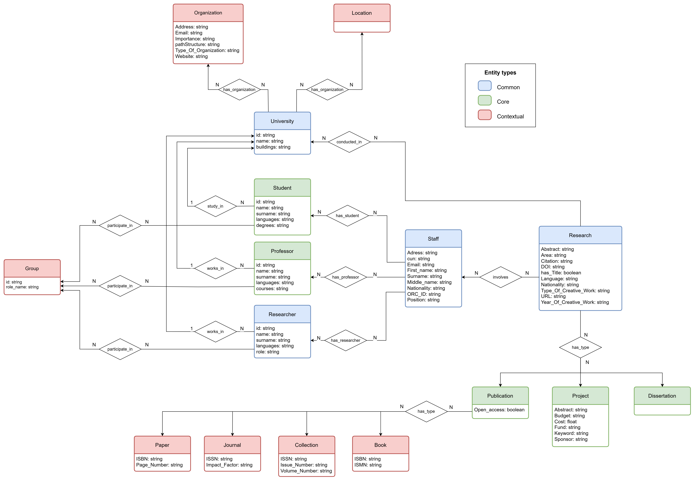
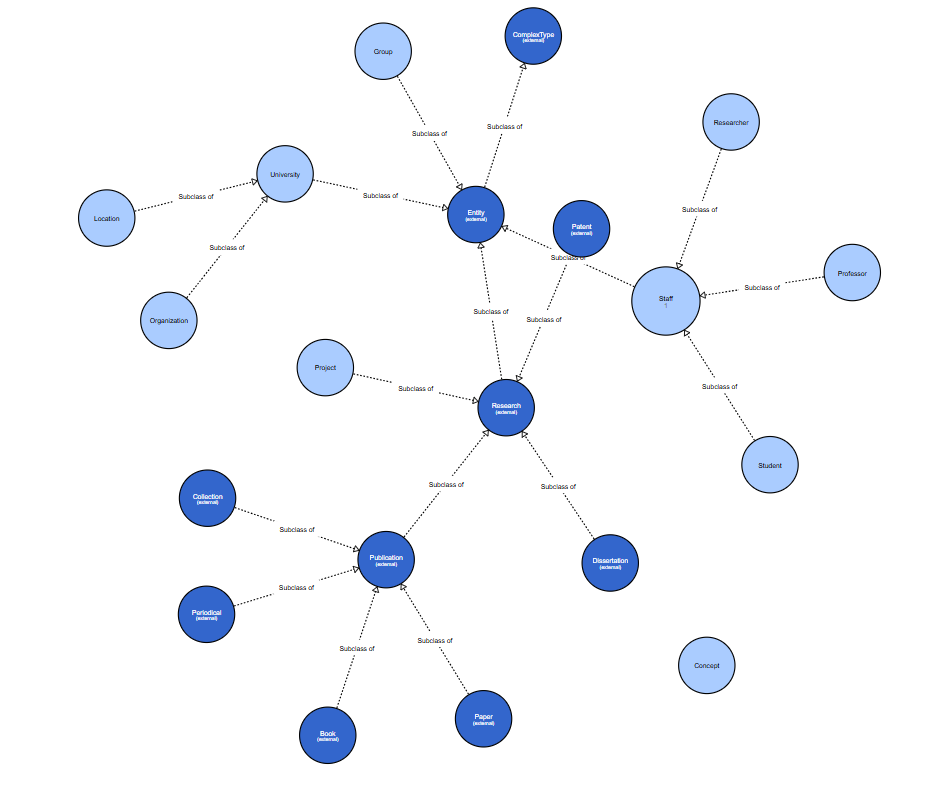
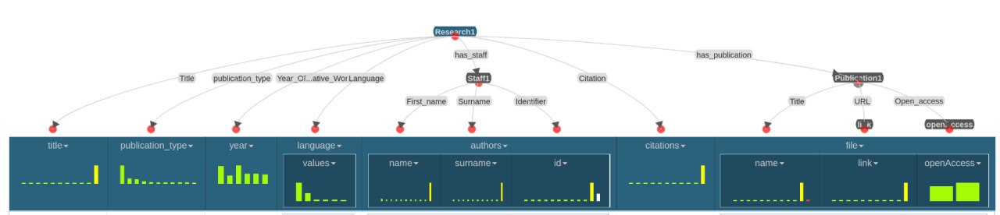

<!-- # peachydew.github.io asd -->
<!-- 
 -->
<!-- 
# KGE Digital University

<h1>KGE Digital University</h1> -->
<!-- 
 -->

*By Riccardo Germenia, Azamat Giniiatullin, Gaia Pizzuti*

# Materials

**Project repository**

The GitHub repository can be found [here](https://github.com/GaiaPizzuti/KGE-project).

**Report**
TO-DO
The report of this project can be found [here]()

**Presentation slides**
TO-DO
The presentation of this project can be found [here]()

# Introduction & Purpose defintion

In this project, we will develop a knowledge graph

The objective of this project is to build a Knowledge Graph able to support application and services providing information about research collaboration (published paper, project or others) between the university of Trento and the national university of Mongolia, describing also the different location of the two university facilities. Development of this KG using  iTelos methodology, a structured  approach that focuses on identifying, modeling, and organizing knowledge elements to improve usability.

## Personas

To formalize the purpose of the project, we provided personas that covers various lifestyles among student which are useful to define diverse interactions with the knowledge graph.Each persona is defined based on the diverse contexts and usage needs of the Knowledge
Graph

>1. Person 1 Dr. Maria Rossi, a Computer Science researcher at the University of Trento with a PhD in AI, has published on Machine Learning and collaborated internationally. 

>2. Person 2 Prof. Bat Erdene, a senior Data Science lecturer at the National University of Mongolia, has 10+ years of experience in data analysis and software development. 

>3. Person 3 Lisa Bianchi, a PhD student at the University of Trento, researches cross-linguistic AI.

>4. Person 4 Dr. Enkhtuul Tserendorj, a research administrator at the National University of Mongolia.

## Scenarios

> **Collaboration Search** - Dr. Maria Rossi's goal is to discover collaboration opportunities with researchers from the National University of Mongolia, track past and ongoing collaborations between both universities and access relevant papers and project information easily.

> **Research Visit** - Prof. Bat Erdene frequently applies for collaborative projects between Mongolia and international universities so he aims to find partners at the University of Trento for potential projects, access past and ongoing project information between the two universities and learn about joint conferences, workshops and seminars.

> **Exploring Possibilities** - Lisa Bianchi's goal is to find supervisors or collaborators from both universities, access datasets or ongoing research projects and understand the locations and facilities for research visits.

> **Tracking Research** - Dr. Enkhtuul Tserendorj's goal is to track and manage research collaborations between the National Univeristy of Mongolia and international institutions like the University of Trento, facilitate the communication between research teams and ensure that collaborative projects properly documented and comply with both universities’ guidelines

## Competency questions 

The competency questions were crafted based on the scenarios and personas, ensuring that
the Knowledge Graph is designed to answer relevant queries for each user role. 

    
Competency questions

    
    CQ1. Which research projects have been conducted in collaboration between the University of Trento and the National University of Mongolia?

    CQ2. Who are the researchers from both universities that have worked together on a specific project or paper?

    CQ3. What are the research areas that have seen the most collaboration between the two universities?

    CQ4. How many collaborative research papers have been published by researchers from both universities over the last five years?

    CQ5. Which ongoing projects between the two universities are receiving external funding?

    CQ6. Which researchers from the University of Trento specialize in artificial intelligence and have collaborated with counterparts at the National University of Mongolia?

    CQ7. Which researchers from the National University of Mongolia have experience in data science and have co-authored papers with researchers from the University of Trento?

    CQ8. What is the academic profile (publications, projects) of a particular researcher from either university?

    CQ9. What are the main research facilities available at both the University of Trento and the National University of Mongolia for collaborative research?

    CQ10. What is the status of an ongoing research project between the two universities, and who are the main contributors?

    CQ11. What are the deliverables and deadlines for specific ongoing projects between the two universities?

    CQ12. Which students are pursuing a PhD in Data Science?

    CQ13. Which PhD students from the University of Trento have been involved in collaborative research with the National University of Mongolia?

## ER Model

# Information Gathering

## Data Resources

**UNITN’s LiveData Platform**

[https://datascientiafoundation.github.io/LiveData-KGE/](https://datascientiafoundation.github.io/LiveData-KGE/)

**NUM’s LiveData Platform**

[https://datascientiafoundation.github.io/LiveDataNUM/](https://datascientiafoundation.github.io/LiveDataNUM/)

**UNITN Website**

[https://www.unitn.it/it](https://www.unitn.it/it)

# Language Definition

We formalized domain-specific concepts for the Knowledge Graph, aligning them with the Universal Knowledge Core (UKC). We structured concepts into a language resource file with multilingual definitions. Datasets were filtered and aligned with the defined vocabulary, removing inconsistencies and standardizing keys. The repository was reorganized for clarity, sources were detailed, and dataset transformations were documented.

# Knowledge Definition

In this phase, we produce the knowledge teleontology for the final knowledge graph by exploiting the concepts we defined in the Language definition phase.

The final teleology.

# Entity Definition

In this last phase, we created our Knowledge graphs. For example, following is the knowledge model for the research.

# Knowledge Graph

[RDF](https://github.com/GaiaPizzuti/KGE-project/blob/main/Phase%205%20-%20Data%20Definition/RDFs/all_data.brf)
